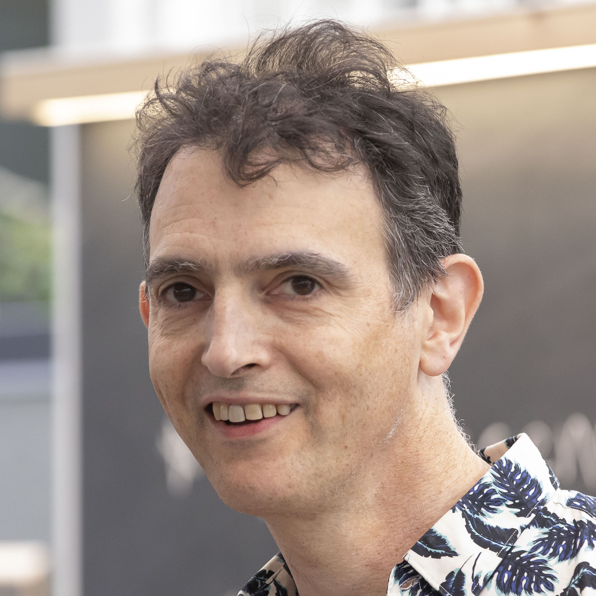
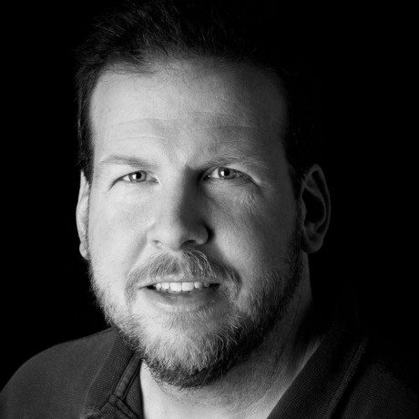



# Welcome To *Better Code*
{:.community-title-slide .zhu}
## An adventure in software engineering Adobe Software Technology Lab  |  https://stlab.cc
{:.subtitle}

## About Your Hosts
{:.images-with-headers}

Dave Abrahams
: 

Sean Parent
: 

# CVs

***WRITEME: about our backgrounds***

> We hope this course/book is generally applicable, but of course we come from a
> set of experiences that will color what we think is important.  We've
> attempted to be responsible for our biases, but in full disclosure, here they
> are.

## Definitions  |  Engineering, *n*
{:data-auto-animate}

> The creative application of scientific principles to design or develop
> structures, machines, apparatus, or manufacturing processes, or works utilizing
> them singly or in combination; or to construct or operate the same with full
> cognizance of their design; or to forecast their behavior under specific
> operating conditions; all as respects an intended function, economics of
> operation and safety to life and property.
{:.blockquote data-mark='
| /creative/, /design or develop/
| /application of scientific principles/
| /forecast their behavior/
| /intended function/,/economics/,/safety/
| /specific operating conditions/' }

—American Engineers' Council for Professional Development
(per [wikipedia.org/wiki/Engineering](https://en.wikipedia.org/wiki/Engineering))

> Making informed tradeoffs to produce the best design or artifact possible
> given a set of constraints.
{:.blockquote}

—Sean

> This is a course about engineering.  So what do we mean by that?
>
> - Consulting definitions very useful; we will do that a lot.
> - Wordy definition, but some standout features:
>   - it's a creative process
>   - Based on scientific principles
>   - to create predictable results
>   - subject to real-world constraints (functionality, economics, safety, shipping dates,
>     cost, Available tooling/hardware, laws of physics…)
>   - correctness is provisional. The fact that the computer might get struck by
>     lightning doesn't make your code unreliable. “specific:” the provisions are
>     *specified*
>
> As engineers we have to juggle all of this and make a set of informed
> tradeoffs to find the best solution.  Real-world constraints mean engineers will
> always confront trade-offs, so much so that making these trade-offs could be
> said to be the essence of the activity.

## Definitions  |  Engineering, *n*
{:data-auto-animate}

> The creative application of scientific principles to <s>design or develop</s>
> **discover** structures, machines, apparatus, or manufacturing processes, or
> works utilizing them singly or in combination; or to construct or operate the
> same with full cognizance of their design; or to forecast their behavior under
> specific operating conditions; all as respects an intended function, economics
> of operation and safety to life and property.
{:.blockquote}

—American Engineers' Council for Professional Development
(per [wikipedia.org/wiki/Engineering](https://en.wikipedia.org/wiki/Engineering))

> Making informed tradeoffs to produce the best design or artifact possible
> given a set of constraints.
{:.blockquote}

—Sean

> One thing we both believe is that in grappling with problems, if you apply
> yourself, you can discover deep platonic truths.  This course/book is about
> finding deep truths about programming.

## About the artist
{:.community-about-slide .zhu}

## The End
{:.community-closer-slide .zhu}
